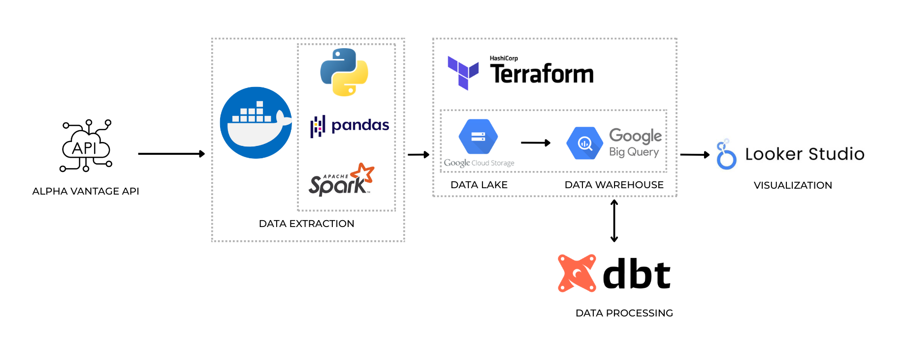
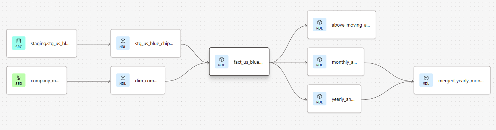
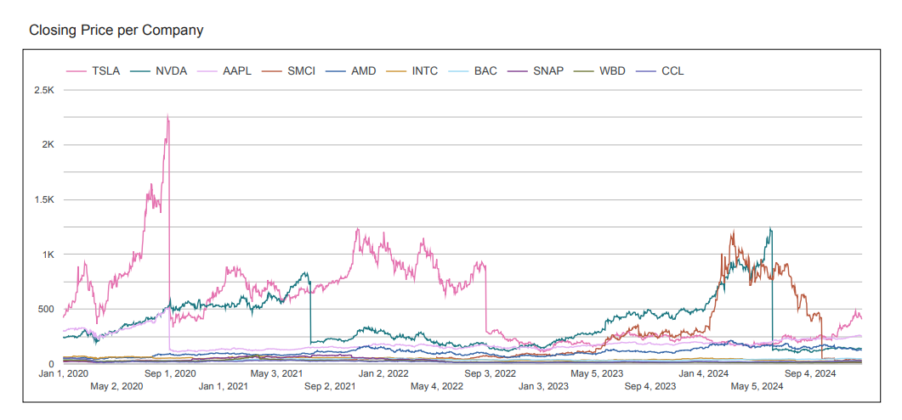
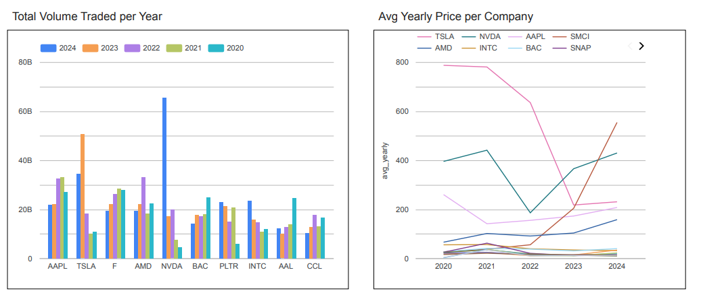
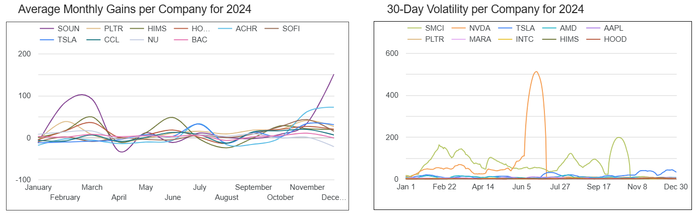

# US-Blue-Chips-Stock-Market-Trends-and-Analysis

This is an ETL project which prepares US Blue Chips Stocks data. The aim of this project is for me to practice building ETL pipelines using different tools a data engineer uses. 

## Features

<p align="center">
    
</p>

- Extracted historical stock prices (2000-2024) from Alpha Vantage API
- Process raw data to CSV using Pandas. Initialized schema and repartitioned into Parquet files using PySpark
- Containerized extraction using Docker
- Created infrastructure using terraform and stored data into Google Cloud Storage (GCS) and BigQuery
- Created data models using [dbt](https://github.com/eddie-mar/DBT-US-Blue-Chips-Stocks.git)
- Visualized trends using Looker Studio

## Usage

### Data Extraction

The script for extracting the data from Alpha Vantage was created using requests, pandas, and pyspark. It was containerized using docker. Create a .env file (hidden in this repo) and add your Alpha Vantage API Key which can be taken for free [here](https://www.alphavantage.co/support/#api-key). Go to data-extraction folder and run:
```bash
docker build -t extract-script .
docker run -it \
    -v $(pwd)$/US-Blue-Chips-Stock-Market-Trends-and-Analysis/data-extraction/output:/app/output \
    extract-script \
    --blue_chips_lst blue_chips.txt \
    --start_year 2000 \
    --end_year 2024
```

### Loading Data using GCP

You must have a GCP service account. If not, go to GCP and under _IAM & Admin_, go to service accounts and create one. Add roles such as Owner, BigQuery Admin, Storage Admin, and Storage Object Admin. After creating service account, go to keys and create JSON. The JSON file will be downloaded. Copy this to your project directory for terraform to reference it.

Infrastructure was created using terraform. Follow installation guide for different operating system: [Terraform Installation Guide](https://developer.hashicorp.com/terraform/install)
In my environment, I am using Windows Subsystem for Linux and I installed using the binary download file.
```bash
wget https://releases.hashicorp.com/terraform/1.12.2/terraform_1.12.2_linux_amd64.zip
unzip terraform_1.12.2_linux_amd64.zip
sudo mv terraform /usr/local/bin/
```

Go to terraform directory, edit terraform files according to your configuration and project variables then run terraform.
```bash
terraform init
terraform plan 
terraform apply
```

To load the parquet files into GCS, you can have three options:
- Upload manually using GCP user interface
- Create a python script and use the library google-cloud-storage
- Use Google Cloud SDK and copy the files in your local env to GCS

I used Google Cloud SDK gsutil command. Follow [Google Cloud SDK installation guide](https://cloud.google.com/sdk/docs/install) and after you 'gcloud init', it will prompt and let you login your GCP account and project. With this, you will have access to your project and copy the files directly.
```bash
gsutil -m cp -r output/stocks/data_raw/ gs://us_blue_chips_buckets/blue_chips_raw
```

After the data is ready in GCS, it is now time to create tables in BigQuery to be used as staging data for dbt modeling.
In GCP:
CREATE OR REPLACE EXTERNAL TABLE `capstone-proj-464212.stg_data.external_stock_data`
OPTIONS (
    format='PARQUET',
    uris=['gs://us_blue_chips_buckets/*']
);

CREATE OR REPLACE TABLE `capstone-proj-464212.stg_data.stg_us_blue_chips`
CLUSTER BY Symbol
AS SELECT * FROM `capstone-proj-464212.stg_data.external_stock_data`;


### Data Modeling

<p align="center">
    
</p>

After the data was loaded into BigQuery, dbt is used to transform and create data models. I used dbt cloud and another github repo for easier and isolated access to dbt modeling. The github repo is located [here](https://github.com/eddie-mar/DBT-US-Blue-Chips-Stocks.git). 
dbt cloud:
dbt deps    (to install dbt packages used)
dbt seed    (to run csv seed file)
dbt run     (to run data models)

I created a staging model first that removes duplicate data, created stockid, and casted the columns to appropriate data types. The dimensions table that contains ticker and company name was created using a seed csv file. Then, using the staging and dimensions, the fact table was created. It generated additional columns:
- previous closing price as prev_closing
- closing price * voume as value_traded
- moving averages for 7 and 30 days
- volatility for 7 and 30 days

I also created models for monthly and yearly gains which calculated rate of change monthly and yearly. Created also is a model that shows if the closing price is above its averages which can be useful in determining how often the stock breaks its averages. 

A different lineage was created for the same fact table but with forward-filled values. I created this to be used in visualization since gaps and null values will be displayed in graphs if data is not filled. This was created separate to the original lineage since I believe that the filled data will affect and the calculated analysis would not be true if the original data is tampered with.

### Visualization

A simple visualization of the data is created using Google Looker Studio. The report can be viewed [here](https://lookerstudio.google.com/s/kWIf6FcE_Bk). I used only the recent data from 2020 for this visualizations.

Time Series for Closing Price per Company


Total Volume and Average Yearly Price


Monthly Gains and Volatility


### For Improvement

This project aims to extract data from US Blue Chips stocks and mainly as practice for creating data pipeline and usage of data engineering tools. The project only took the top 25 most active stocks as the API has a 25/day limit. More company stocks' data can be extracted by getting a premium API or by requesting data in other days. 
The project can also be orchestrated using Kestra and Airflow. I haven't done this since I think that I will only be extracting the historical data in one go but orchestration will still be useful per say adding batch company data or for orchestration and sequencing of the different tools used.
